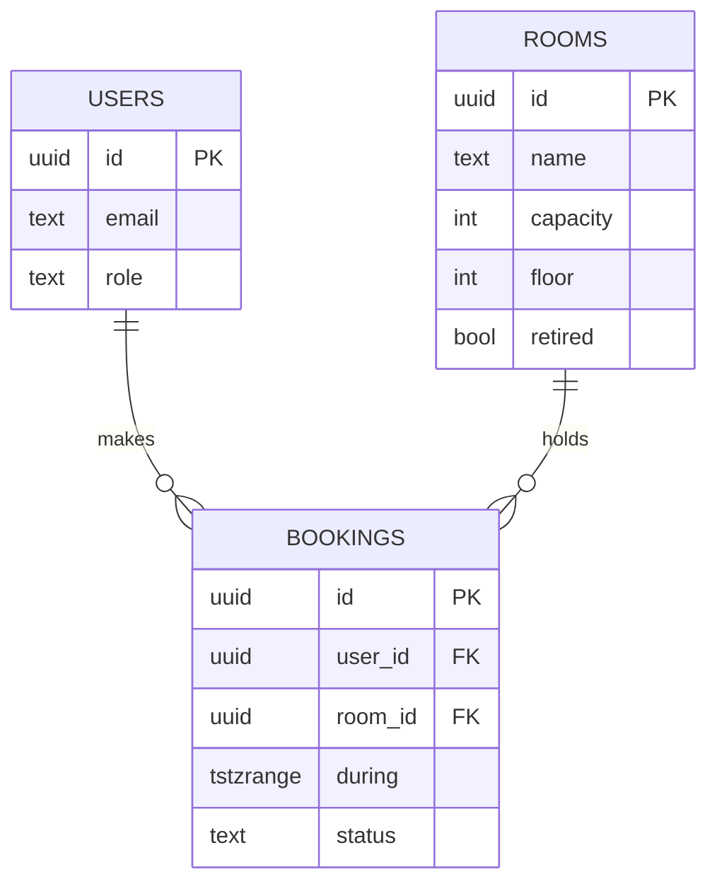

# Database Design — Roomly

**Version:** 1.0.0
**Date:** 2026-05-24
**Status:** Final
**Source:** SRS v1.0.0, ARCHITECTURE v1.0.0
**Owner:** Tech Lead

---

Physical schema for PostgreSQL (`TS-DATA-01`). The exclusion constraint on `db.bookings` enforces `BR-BOOK-01` at the datastore (`AD-02`).

## 1. ER diagram



## 2. DDL

```sql
CREATE TABLE rooms (
  id       uuid PRIMARY KEY DEFAULT gen_random_uuid(),
  name     text NOT NULL,
  capacity int  NOT NULL CHECK (capacity > 0),
  floor    int  NOT NULL,
  retired  boolean NOT NULL DEFAULT false
);

CREATE TABLE bookings (
  id      uuid PRIMARY KEY DEFAULT gen_random_uuid(),
  user_id uuid NOT NULL REFERENCES users(id),
  room_id uuid NOT NULL REFERENCES rooms(id),
  during  tstzrange NOT NULL,
  status  text NOT NULL DEFAULT 'confirmed',
  -- BR-BOOK-01: no two confirmed bookings overlap for one room
  EXCLUDE USING gist (room_id WITH =, during WITH &&)
    WHERE (status = 'confirmed')
);
```

## 3. Tables

| Table | Purpose |
|-------|---------|
| `db.users` | Authenticated employees and managers. |
| `db.rooms` | Bookable rooms. |
| `db.bookings` | Confirmed/cancelled reservations. |

## Traceability

| Local ID | Upstream IDs |
|----------|--------------|
| `db.bookings` | `FR-BOOK-001`, `BR-BOOK-01`, `AD-02` |
| `db.rooms` | `FR-ROOM-001`, `FR-ADMIN-001` |

## Change Log

| Version | Date | Author | Change |
|---------|------|--------|--------|
| 1.0.0 | 2026-05-24 | Tech Lead | Initial schema + exclusion constraint. |
