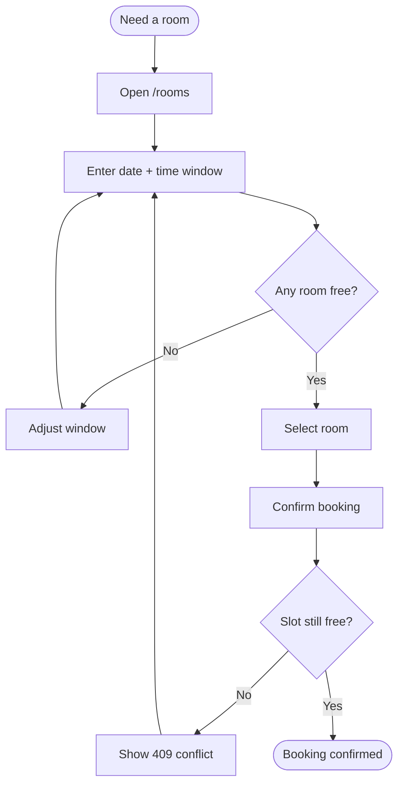
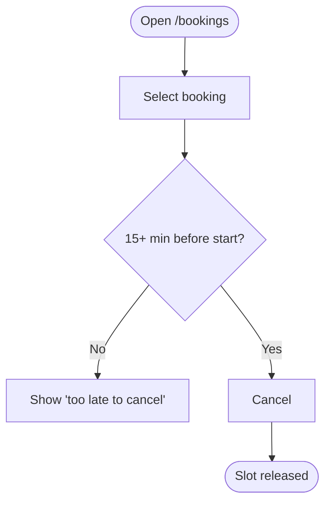

# User Flows — Roomly

**Version:** 1.0.0
**Date:** 2026-05-24
**Status:** Final
**Source:** USECASES v1.0.0
**Owner:** Product Lead

---

End-to-end journeys. Diagrams realize the use cases in [USECASES](./USECASES.md).

## UF-01 Search to booking

**Trigger:** Employee needs a room for a meeting.

**Routes:** `/rooms`, `/rooms/:id`
**Realizes:** `UC-BOOK-01`

## UF-02 Cancel a booking

**Trigger:** Employee no longer needs a reserved room.

**Routes:** `/bookings`
**Realizes:** `UC-BOOK-02`

## Traceability

| Local ID | Upstream IDs |
|----------|--------------|
| `UF-01` | `UC-BOOK-01` |
| `UF-02` | `UC-BOOK-02` |

## Change Log

| Version | Date | Author | Change |
|---------|------|--------|--------|
| 1.0.0 | 2026-05-24 | Product Lead | Initial flows with diagrams. |
