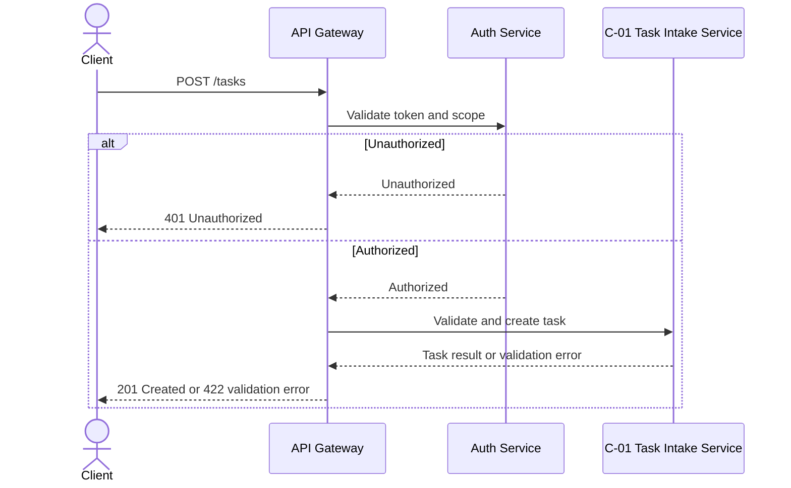

# API Reference Example — TaskFlow Lite

> Illustrative example only. Adapt the pattern to project evidence; do not copy this as a fixed skeleton.

Project context: TaskFlow Lite helps a support team intake, triage, assign, and verify small customer tasks before release.

## Endpoint Example

### API-TASK-001 Create task

`POST /tasks`

**Description:** create a normalized task in the triage queue.

**Request example:**

```json
{
  "title": "Verify billing export",
  "source": "support-email",
  "priority": "High",
  "ownerCandidate": "eng-ops"
}
```

**Responses:**
- `201 Created` with task ID and status.
- `422 Unprocessable Entity` when priority is missing.

**Trace:** FR-TASK-001, C-01, TC-TASK-001

**Lifecycle sketch:**


