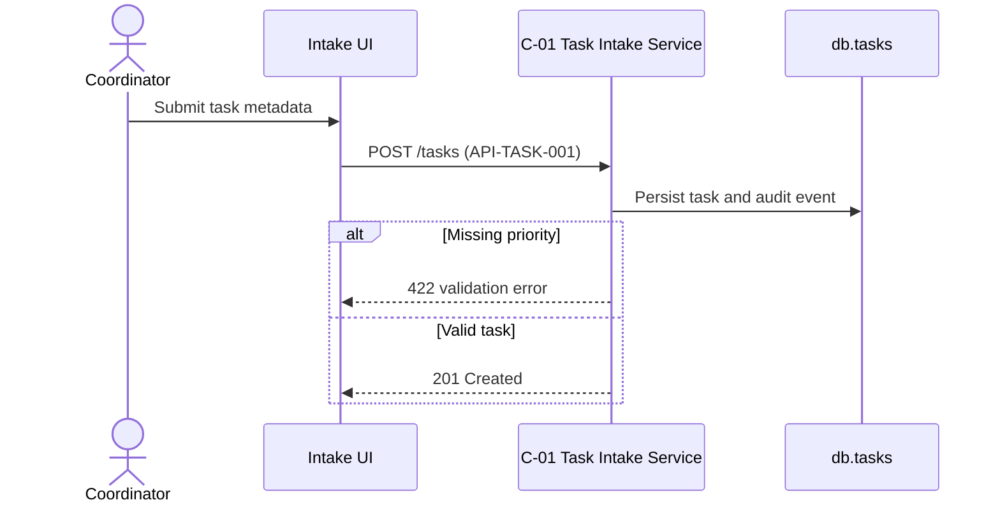

# Architecture Example — TaskFlow Lite

> Illustrative example only. Adapt the pattern to project evidence; do not copy this as a fixed skeleton.

Project context: TaskFlow Lite helps a support team intake, triage, assign, and verify small customer tasks before release.

## Component Example

At a glance:

| ID | Name | Status | Key links |
|---|---|---|---|
| C-01 | Task Intake Service | Ready | FR-TASK-001, API-TASK-001 |

### C-01 Task Intake Service

**Responsibility:** validate incoming task metadata and persist normalized tasks.

**Owned data:** `db.tasks`, `db.task_events`.

**Exposed interface:** `POST /tasks` (API-TASK-001).

**Dependencies:** TS-LANG-01, TS-DATA-01.

**Related requirements:** FR-TASK-001.

### AD-01 SQLite for v1

**Status:** Accepted.
**Consequence:** easy local setup; future hosted collaboration will require migration planning.

## Sequence Diagram Example

