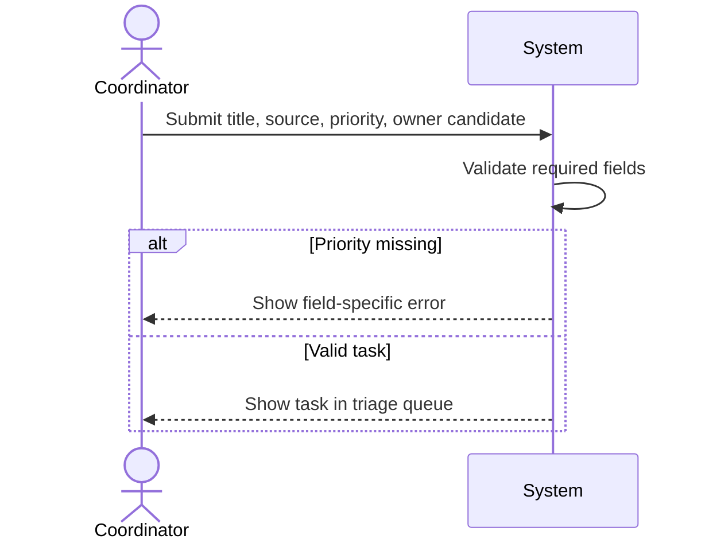

# Use Cases Example — TaskFlow Lite

> Illustrative example only. Adapt the pattern to project evidence; do not copy this as a fixed skeleton.

Project context: TaskFlow Lite helps a support team intake, triage, assign, and verify small customer tasks before release.

## Use Case Example

### UC-TASK-01 Triage new task

**Primary actor:** Support coordinator

**Preconditions:** coordinator is authenticated; task source is known.

**Main success scenario:**
1. Coordinator opens intake.
2. Coordinator enters task metadata.
3. System validates required fields.
4. System stores the task and event.
5. System shows the task in triage queue.

**Extensions:**
- 3a. Priority missing: system blocks save and names the missing field.

**Related:** FR-TASK-001, TC-TASK-001

**Main scenario sequence:**

