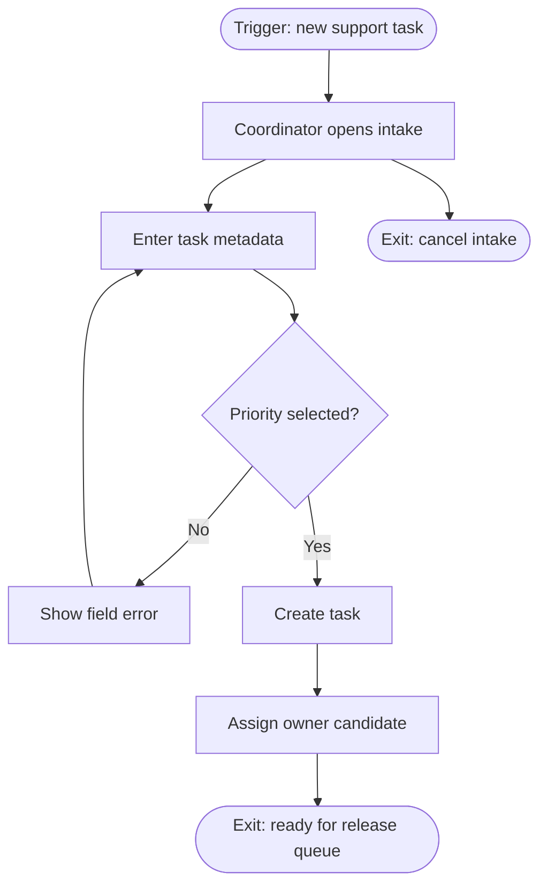

# User Flows Example — TaskFlow Lite

> Illustrative example only. Adapt the pattern to project evidence; do not copy this as a fixed skeleton.

Project context: TaskFlow Lite helps a support team intake, triage, assign, and verify small customer tasks before release.

## Flow Example

### UF-01 Intake to assignment

**Trigger:** coordinator receives a support task that needs release verification.

**Main path:** intake → validation → owner candidate → release queue.

**Branches:** missing priority returns to intake with a field-specific error.

**Exits:** task ready for release queue; coordinator cancels intake.

**Recovery:** preserve draft metadata after validation failure.

**Routes:** `/tasks/new`, `/tasks/:id`
**Related UCs:** UC-TASK-01
