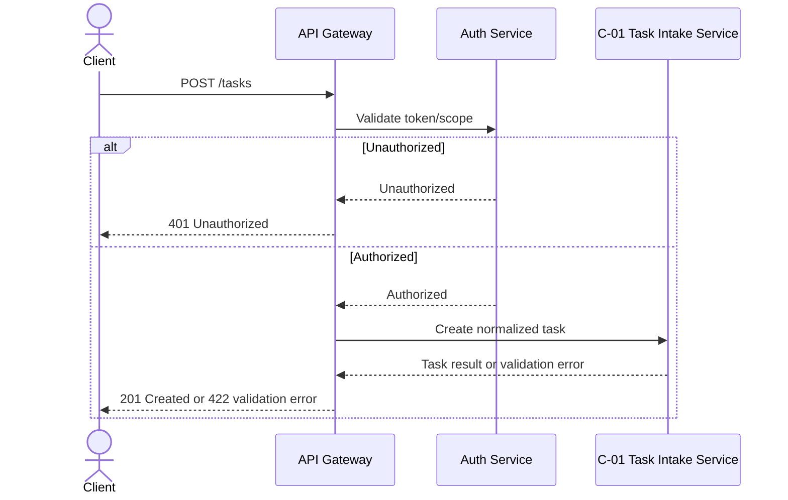

# API Reference Guide

Use this guide when creating, extracting, updating, or reviewing `API_REFERENCE.md`. Also apply `reference/STYLE.md` for headers, IDs, versioning, traceability, and table conventions.

## Purpose and Audience

Curates API contracts: endpoints, auth, request/response examples, errors, rate limits, webhooks, and deprecation policy. Write for implementers, reviewers, and future agents who need clear scope, source evidence, and testable decisions.

## When to Include or Skip

Include `API_REFERENCE.md` when the selected archetype or change request needs this artifact. Skip it when it would only repeat another doc without adding implementation or verification value. If skipped, record the reason in PRD §Doc Set.

## Inputs to Read First

- SRS behavior, architecture components, route handlers, OpenAPI specs, client SDKs, tests.
- Upstream docs in the source-of-truth order.
- Existing downstream docs only to preserve traceability, not to invent upstream scope.


## Document-Specific Guidance

- Hand-curate intent and contract; do not paste generated OpenAPI output wholesale.
- Group endpoints by resource and assign `API-{RESOURCE}-{NNN}` IDs.
- Include auth, scopes, request/response examples, errors, pagination/filtering, rate limits, and deprecation policy as applicable.
- Add a Mermaid `sequenceDiagram` for endpoint lifecycles with multi-step auth, callbacks/webhooks, async jobs, retries, or important error flows.
- Every public/internal endpoint in scope cites `FR-*` and owning `C-*`.

## Writing Strategy

- Open with a one-sentence summary and, when the doc has more than a few items, an `At a glance` table that lists IDs, names, status, owner/source, and key links.
- Use short tables, bullets, status badges such as `Draft`/`Ready`/`Blocked`, and cross-references instead of long prose.
- Link related `F-*`, `FR-*`, `US-*`, `UC-*`, `UF-*`, `TC-*`, and `M*` IDs to known markdown anchors; use bare ID text only when the target file/anchor is unknown.
- Add Mermaid visual aids only when they reduce reading time or clarify branching, ownership, timing, or dependencies.
- Start from evidence and decisions, not from a fixed section shape.
- Choose sections that make the project implementable and auditable.
- Use stable IDs from `reference/STYLE.md`; do not create parallel ID systems.
- State assumptions, exclusions, dependencies, risks, and open questions explicitly.
- Prefer tables for index/catalog material and prose for rationale/tradeoffs.
- Cite user decisions, files, commits, tests, or upstream docs for non-obvious claims.

## Flexible Structure

A strong `API_REFERENCE.md` normally contains:

1. Purpose/context.
2. Index/catalog of the main items.
3. Detailed entries with IDs, source, status, and rationale.
4. Traceability to upstream/downstream docs.
5. Open questions or risks that block implementation confidence.
6. Change Log.

Adapt or omit sections when irrelevant; do not force empty sections.

## Traceability Rules

Owns `API-*`. Every endpoint cites `FR-*` and `C-*`; tests cite API IDs when contract behavior is verified.

## Good Example Snippet

See `examples/api-reference-example.md`. Endpoint entries should show contract and ownership:

```markdown
API-TASK-001 POST /tasks
201 Created; 422 when priority is missing.
Trace: FR-TASK-001, C-01, TC-TASK-001.
```



## Anti-Patterns

- Copying an example verbatim instead of adapting it to project evidence.
- Keeping empty sections because another project had them.
- Adding scope that is not present in PRD or an approved user decision.
- Using generic IDs such as `REQ-1` when canonical prefixes exist.
- Omitting source citations for inferred brownfield behavior.

## Brownfield Extraction Tips

- Identify real entry points first: routes, commands, pages, jobs, schemas, tests, and config.
- Treat test names and fixtures as behavior evidence, but mark product intent as inferred unless confirmed.
- Preserve existing names/contracts where they are public or persisted.
- Capture contradictions between docs, code, and tests as open questions or review findings.

## Update and Ripple Guidance

- Patch: wording, links, formatting, missing trace rows.
- Minor: new compatible ID/item/section or refined behavior.
- Major: decision reversal, removed scope, breaking contract, ID retirement.
- Update the owning upstream doc first, then cascade downstream.

## Verification Checklist

- [ ] Header, version, source, owner, and Change Log follow `reference/STYLE.md`.
- [ ] Every ID uses the canonical prefix registry.
- [ ] Every item has an upstream source or explicit inferred status.
- [ ] Traceability rows are complete for included docs.
- [ ] No downstream-only scope was introduced.
- [ ] Skipped or omitted sections are intentional and explained when material.
