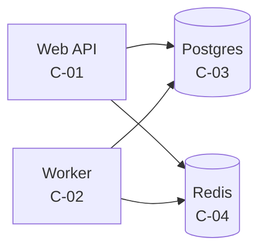
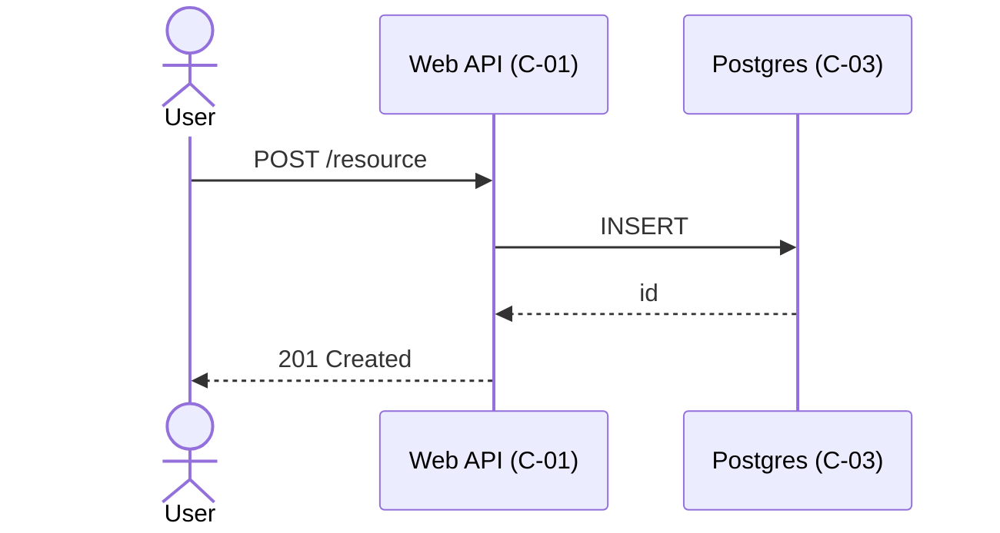
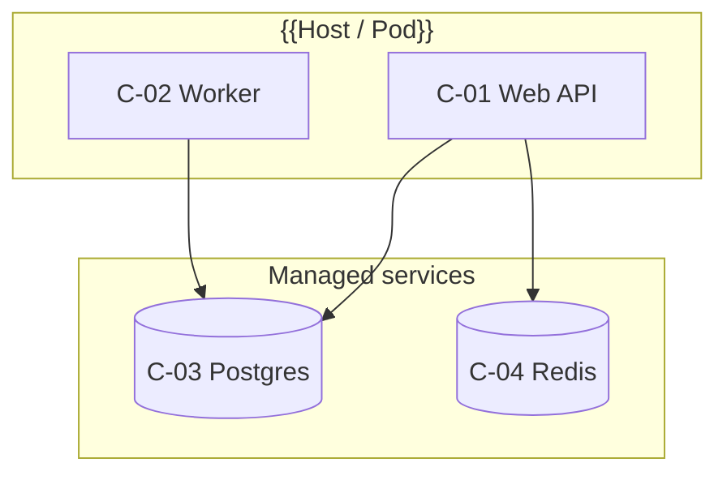

# Architecture — {{PROJECT_NAME}}

**Version:** {{SEMVER}}
**Date:** {{YYYY-MM-DD}}
**Status:** Draft
**Source:** PRD v{{x.y}} §5, TECHSTACK v{{x.y}}
**Owner:** {{name}}

---

## 1. Purpose

How the system is decomposed into components, how they communicate, where they run, and which significant decisions shaped the design. Behavior requirements live in SRS — this doc covers structure and rationale.

## 2. Conventions

- Components: `C-{NN}`. One component = one deployable unit OR one cohesive module with a stable interface.
- Decisions: `AD-{NN}` (ADR-lite). Each has Status ∈ {`Proposed`, `Accepted`, `Superseded`, `Inferred`}.
- `Inferred` = decision extracted from existing code without original author input (brownfield).

## 3. Context (C4 L1)

```mermaid
flowchart LR
    user([User])
    sys[{{System}}]
    ext1[{{External Service A}}]
    ext2[{{External Service B}}]
    user --> sys
    sys --> ext1
    sys --> ext2
```

External actors and systems we touch. One paragraph per external dependency: what we send/receive, SLA, failure mode.

## 4. Containers (C4 L2)



Each box = a process boundary. Edges labelled with protocol (HTTP, gRPC, SQL, AMQP).

## 5. Components

### `C-{NN}` {{Component Name}}

**Responsibility:** one sentence — what this component owns.
**Type:** {{service | worker | library | daemon | scheduled job | UI app}}
**Owned data:** {{tables / topics / files this is the sole writer of}}
**Exposed interface:** {{HTTP routes / gRPC services / CLI / events emitted}}
**Consumes:** other components (`C-XX`) + external systems.
**Tech:** `TS-FW-02`, `TS-LANG-01`, ... (TECHSTACK IDs)
**Source dir:** `src/{{path}}/`
**Process boundary:** {{own container | in-process with C-XX}}
**Scaling:** {{stateless N replicas | singleton | sharded by {{key}}}}
**Failure mode:** what happens when this component is down.
**Related FRs:** `FR-XXX-NNN`, ...
**Related BR:** `BR-XXX-NN`

(Repeat for every component.)

## 6. Data Flow

For each significant flow (request lifecycle, async job, scheduled task):

### 6.1 {{Flow Name}}



Trigger, components, ordering, error paths. Cross-ref `UF-NN`.

## 7. Deployment Topology

### 7.1 Environment matrix

| Environment | Host model | Components | Network binds |
|-------------|-----------|-----------|---------------|
| dev | docker-compose | all | `127.0.0.1` |
| staging | {{...}} | all | {{...}} |
| prod | {{...}} | all | {{...}} |

### 7.2 Network

- Public ingress: {{port, protocol, who terminates TLS}}
- Internal network: {{VPC / docker network / k8s service mesh}}
- Outbound egress: {{allowlist domains}}

### 7.3 Process layout



## 8. Integration Points

| External | Direction | Protocol | Auth | Rate limit | Failure handling |
|----------|-----------|----------|------|-----------|------------------|
| {{name}} | inbound/outbound | HTTPS/JSON | {{API key / OAuth2}} | {{N/sec}} | {{retry / circuit-break / queue}} |

## 9. Cross-Cutting Concerns

| Concern | Approach | Component owners |
|---------|----------|------------------|
| AuthN/Z | {{JWT / session / mTLS}} | `C-01` |
| Observability | {{logs structured to stdout, metrics via Prometheus}} | all (`TS-OBS-06`) |
| Config | {{env vars, file path}} | all |
| Secrets | {{store, injection method}} | all (`TS-SEC-07`) |
| Tracing | {{tool, sampling rate}} | all |
| Healthchecks | `/healthz`, `/readyz` | `C-01`, `C-02` |
| Backpressure | {{queue depth / circuit breaker}} | `C-02` |

## 10. Architectural Decisions (ADR-lite)

### `AD-{NN}` {{Title}}

**Status:** Accepted | Proposed | Superseded by `AD-XX` | Inferred
**Date:** {{YYYY-MM-DD}}
**Context:** what forces drove this decision (constraints, prior state, options on the table).
**Decision:** what we chose. One sentence.
**Consequences:**
- Positive: {{...}}
- Negative: {{...}}
- Neutral: {{...}}
**Alternatives considered:**
- {{Option}} — rejected because {{...}}
**Related TS:** `TS-XX-NN`
**Related components:** `C-NN`, `C-MM`
**Source (brownfield only):** commit `<sha>` / PR `#NNN` / `Inferred from code`

(Repeat per decision. Aim for 5–15 ADRs total — only material ones.)

## 11. Risks & Trade-offs

| Risk | Impact | Mitigation | Tracked in |
|------|--------|-----------|-----------|
| {{e.g. single Postgres = SPOF}} | {{...}} | {{...}} | PRD §10 |

---

## Traceability

### Components → SRS

| Component | FRs implemented |
|-----------|----------------|
| `C-01` | `FR-AUTH-001`, `FR-AUTH-002` |

### Components → TECHSTACK

| Component | TS IDs consumed |
|-----------|----------------|
| `C-01` | `TS-LANG-01`, `TS-FW-02`, `TS-OBS-06` |

### ADRs → Components

| AD | Affects |
|----|---------|
| `AD-01` | `C-01`, `C-02` |

## Change Log

| Version | Date | Author | Change |
|---------|------|--------|--------|
