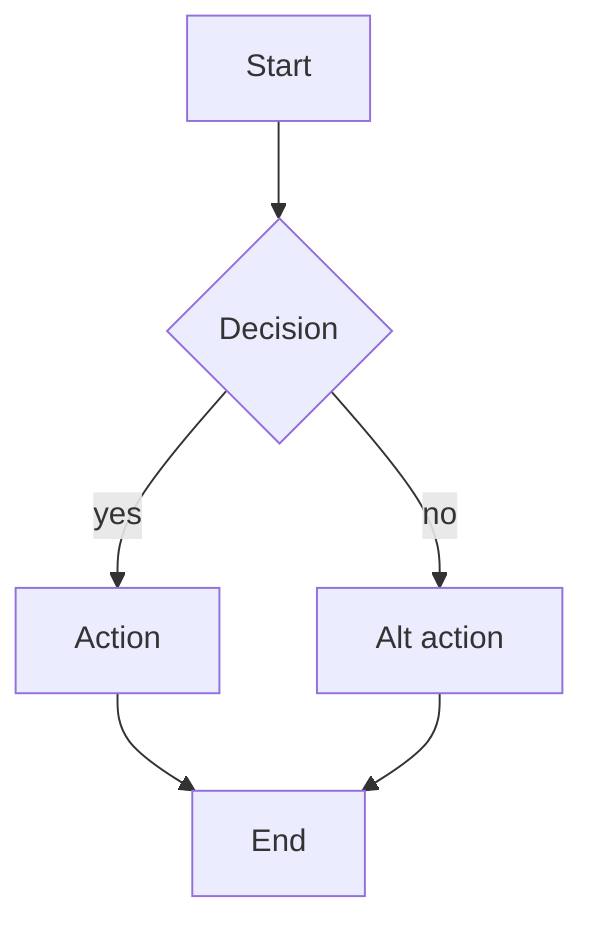

# User Flows — {{PROJECT_NAME}}

**Version:** {{SEMVER}}
**Date:** {{YYYY-MM-DD}}
**Status:** Draft
**Source:** UseCases v{{x.y}}, SITEMAP v{{x.y}}
**Owner:** {{name}}

---

## 1. Conventions

- Branching journeys: Mermaid `flowchart TD`.
- Actor-system interactions: Mermaid `sequenceDiagram`.
- Each flow lists: trigger, actors, steps, exit conditions, cross-refs.
- Test every diagram at mermaid.live before claiming complete.

## 2. Flow Index

| UF ID | Name | Trigger | UCs Stitched |
|-------|------|---------|--------------|
| UF-{NN} | {{name}} | {{event}} | `UC-X-NN`, `UC-Y-NN` |

## 3. Flows

### UF-{NN} {{Flow Name}}

**Trigger:** {{event that starts flow}}.
**Actors:** {{primary actor}}, {{system}}.
**Exit conditions:** {{success exit}} / {{failure exit}}.
**Related UCs:** `UC-X-NN`, `UC-Y-NN`.
**Related routes:** `/path1` → `/path2`.

**Narrative:**
1. Step describing actor action and system response.
2. Step.
3. Step.

(Repeat for each flow. Aim for 10–15 flows covering the operator's full journey.)

## 4. Cross-Flow Map

Which UF stitches which UCs:

| UF | UCs |
|----|-----|

## 5. Route Coverage Check

Every gated SITEMAP route must appear in ≥1 flow:

| Route | Covered by |
|-------|------------|

---

## Traceability

| UF ID | UCs | SRS |
|-------|-----|-----|

## Change Log

| Version | Date | Author | Change |
|---------|------|--------|--------|
